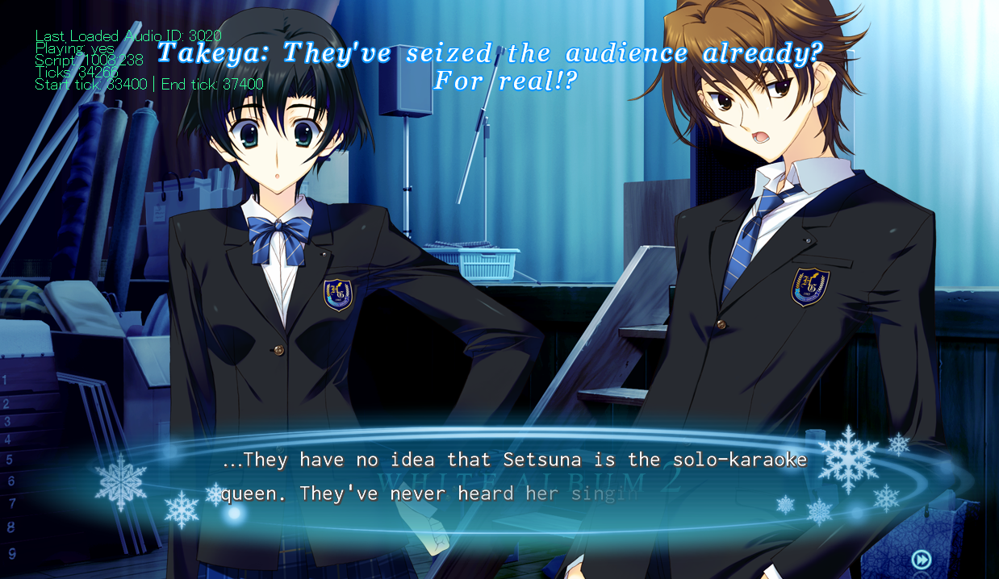

# TodokanaiTL subtitle patch



## Setting up the project
- obviously you need to configure this project with VS community (I use 2019)
- You need to install DirectX 9.0 June 2010 SDK from Microsoft.

Configure the compilation settings to output a single DLL titled `d3d9.dll` and place this in the root of the White Album 2 install folder.

Additionally, create a folder called `todokanai` in the root of the White Album 2 install folder and put `font.png` from the `wa2/` source directory and your subtitle file simply called `subtitles` inside of it.

## Subtitle Format

In the `White Album 2\todokanai` folder, there needs to be two files, the first being the font atlas `font.png` and the second being simply titled `subtitles` (no extension).

Please note that <b>ALL</b> subtitles must be ASCII. That means that MS elipse characters, MS single quotes, and MS double quotes must be replaced with `...`, `'`, and `"` respectively.

The carat character `^` is a linebreak, to make it look right, don't use any spaces surrounding it.

Subtitles take on the following format:

```
{
1002 305 1002 307
500 5000 This text will be displayed from 500 ms from the^trigger until 5000ms from the trigger
5500 7000 the trigger is the 4 numbers at the top: start_file^start_line end_file end_line
7500 8500 There's no hard limit on subtitle length etc.
}

{
1003 409 1003 410
500 5000 etc etc etc
5500 7000 more text more text more text^now on a new line.
}
```

## Debug Information

There is some information about the game context as well as subtitle playback that can be displayed on screen if the project is compiled using the `_TTL_DEBUG` preprocessor definition.